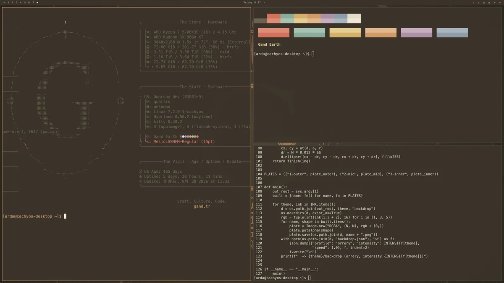

# Gand — an Omarchy theme

Aged manuscript by firelight: warm ink-brown, bronze accents, a celestial sigil. Taken from the CSS custom properties of gand.tr.



## Install

```sh
omarchy theme install https://github.com/c0ze/omarchy-gand-theme
```

Or in the menu: **Super + Space → Install → Style → Theme**, then paste the URL.

## What is in here

`colors.toml` is the palette. `backgrounds/` holds three wallpapers —
Omarchy cycles them, and `omarchy theme bg next` steps through. There is also
an `icons.theme` and `unlock.png` for the Plymouth boot screen. Neovim and
VS Code need no files here: Omarchy regenerates their configs from
`colors.toml` when it stages an installed theme.

`backdrop/` holds plates for an **animated wallpaper layer**. It does nothing
on its own — it needs the small Quickshell plugin that ships with the full set:

> **[c0ze/omarchy-themes](https://github.com/c0ze/omarchy-themes)** — all ten
> themes across four families, the backdrop plugin, the About and screensaver
> branding, and the generators that build every asset from its source artwork.

## Where the colours came from

Not one of them was picked by eye. Every value is read out of the project this
theme is named after. There is a [write-up](https://blog.arda.tr/blog/2026-08-23-ten-omarchy-themes/)
and a [three-minute demo](https://youtu.be/2rXn40bUuC8) of all ten.
